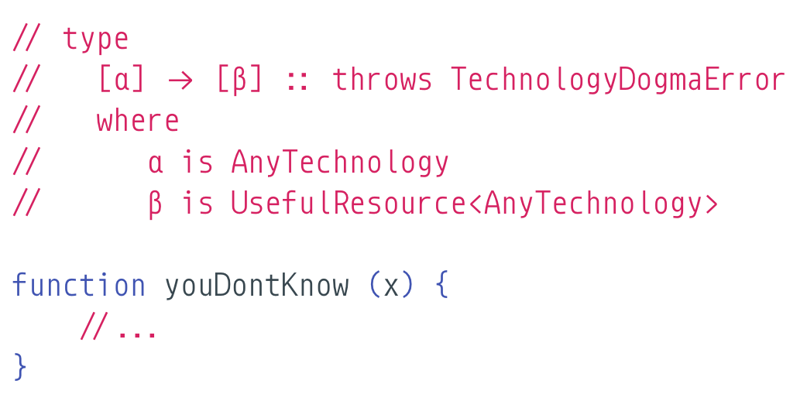

<h1 align="center">
	
	 
	 
</h1>

 
 

	<b>✨"The mind, once stretched by a new idea, never regains its original dimensions" ✨</b>
     
     ~ probably ~<i> Oliver Wendell Holmes, Sr </i>

 

---

	<a href=".github/CONTRIBUTING.md">Contribution Guide</a>&nbsp;&nbsp;&nbsp;
	<a href="WISHLIST.md">Wishlist</a>&nbsp;&nbsp;&nbsp;
	<a href="LICENSE.md">License</a>&nbsp;&nbsp;&nbsp;
	

 

## Table of Contents

> Pick a knowledge area on which you think you've achieved knowledge enough.

<!-- DO NOT EDIT THE COMMENTS BELOW -->

<!-- toc -->

- [Math](#math)
- [Miscellaneous](#miscellaneous)
- [Programming Languages](#programming-languages)
  * [Go](#go)
  * [JavaScript](#javascript)
  * [Kotlin](#kotlin)
- [Programming Languages Theory](#programming-languages-theory)
  * [Compilers](#compilers)
  * [General](#general)
  * [Type Systems and related](#type-systems-and-related)
  * [Meta-Programming](#meta-programming)
  * [Programming Paradigms](#programming-paradigms)
    + [Functional](#functional)
    + [Object-Oriented](#object-oriented)
- [Security](#security)
- [Blockchain](#blockchain)
- [Web Development](#web-development)
  * [Front-End Development](#front-end-development)
    + [React](#react)

<!-- tocstop -->

## Math

- [The Genuine Sieve of Eratosthenes](https://www.cs.hmc.edu/~oneill/papers/Sieve-JFP.pdf)
  - **Author(s)**: [*Melissa E. O’Neill*](https://www.cs.hmc.edu/~oneill/)
  - **Tags**: *functional programming*, *haskell*, *lazy*, *Sieve of Eratosthenes*

## Miscellaneous

- [What happens when...](https://github.com/alex/what-happens-when)
  - **Author(s)**: [*Alex Gaynor*](https://github.com/alex)
  - **Tags**: *DNS*, *ARP*, *TLS*, *HTTP*, *Browser*, *HTML*, *JavaScript*, *CSS*

## Programming Languages

### Go

- [Go is not good](https://github.com/ksimka/go-is-not-good)
  - **Author(s)**: [*Maksim Kochkin*](https://github.com/ksimka)
  - **Tags**: *poor design*, *immature languages*

### JavaScript

- [How do Promises Work?](http://robotlolita.me/2015/11/15/how-do-promises-work.html)
  - **Author(s)**: [*Quil*](https://github.com/robotlolita)
  - **Tags**: *promises*, *asynchronous programming*

- [On semicolons, pseudo-technical and subjective arguments, revisited](http://robotlolita.me/2012/04/16/on-semicolons-and-subjective-discussions-revisited.html)
  - **Author(s)**: [*Quil*](https://github.com/robotlolita)
  - **Tags**: *Automatic Semicolon Insertion*

- [Why does ++[[]][+[]]+[+[]] return the string “10”](http://stackoverflow.com/a/7202287/7203176)
  - **Author(s)**: [*xufox*](http://stackoverflow.com/users/4642212/xufox)
  - **Tags**: *operators*, *precedence*, *ECMAScript*, *spec*

- [You Don't Know JS (book series)](https://github.com/getify/You-Dont-Know-JS)
  - **Author(s)**: [*Kyle Simpson*](https://github.com/getify)
  - **Tags**: *ECMAScript*, *Education*, *E-books*

- [Immer, Immutability and the Wonderful World of Proxies (talk)](https://www.youtube.com/watch?v=FKRVDfpQ9cw)
  - **Author(s)**: [*Michel Weststrate*](https://github.com/mweststrate)
  - **Tags**: *proxies*, *immutability*

- [Why does JavaScript's await only work within async functions?](https://www.quora.com/Why-does-JavaScripts-await-only-work-within-async-functions/answer/Quildreen-Motta?fbclid=IwAR0f7j7xtTpkvJ-IkvaU0F-Fn7eYj-wgv05-WVO3bbuMFjss2ekQ3DA4fGI)
  - **Author(s)**: [*Quil*](https://github.com/robotlolita)
  - **Tags**: *promises*, *asynchronous programming*  

### Kotlin

- [Kotlin: The Good, The Bad, and the Ugly](https://medium.com/keepsafe-engineering/kotlin-the-good-the-bad-and-the-ugly-bf5f09b87e6f)
  - **Author(s)**: [*AJ Alt*](https://github.com/ajalt)
  - **Tags(s)**: *Bad and good things using Kotlin*

## Programming Languages Theory

### Compilers

- [If C and C++ give the best performance, why do we still code in other languages?](https://www.quora.com/If-C-and-C++-give-the-best-performance-why-do-we-still-code-in-other-languages/answer/Quildreen-Motta)
  - **Author(s)**: [*Quil*](https://github.com/robotlolita)
  - **Tags**: *compilers*, *C*, *C++*, *optimisations*

### General

- [Are there any programming concepts not yet implemented? What are they?](https://www.quora.com/Are-there-any-programming-concepts-not-yet-implemented-What-are-they/answer/Quildreen-Motta)
  - **Author(s)**: [*Quil*](https://github.com/robotlolita)
  - **Tags**: *First-class operatives*, *Kernel*, *Algebraic Effect Handlers*, *Eff*,*Type-Specific Languages*, *Wyvern*

- [What are zero-cost abstractions in programming languages?](https://www.quora.com/What-are-zero-cost-abstractions-in-programming-languages/answer/Quildreen-Motta)
  - **Author(s)**: [*Quil*](https://github.com/robotlolita)
  - **Tags**: *abstractions*, *zero-overhead principle*, *zero-cost abstractions*

### Type Systems and related

- [How can a programming language have no primitive types (i.e. strings, integers, booleans)?](https://www.quora.com/How-can-a-programming-language-have-no-primitive-types-i-e-strings-integers-booleans/answer/Quildreen-Motta)
  - **Author(s)**: [*Quil*](https://github.com/robotlolita)
  - **Tags**: *primitive types*, *built-in types*, *Lambda Calculus*

- [How are higher-kinded types different from type constructors with parametrized generic types?](https://www.quora.com/How-are-higher-kinded-types-different-from-type-constructors-with-parametrized-generic-types/answer/Quildreen-Motta)
  - **Author(s)**: [*Quil*](https://github.com/robotlolita)
  - **Tags**: *higher-kinded types*

### Meta-Programming

- [Towards a fully-reflective meta-programming language](http://crpit.com/confpapers/CRPITV38Neverov.pdf)
  - **Author(s)**:
  	- [*Gregory Neverov*](http://dblp.uni-trier.de/pers/hd/n/Neverov:Gregory),
	- [*Paul Roe*](https://www.researchgate.net/profile/Paul_Roe)
  - **Tags**: *compilers*, *object-oriented systems*, *meta-programming*

### Programming Paradigms

#### Functional

- [Why is a functional language generally better at concurrency than OO?](https://www.quora.com/Why-is-a-functional-language-generally-better-at-concurrency-than-OO/answer/Quildreen-Motta)
  - **Author(s)**: [*Quil*](https://github.com/robotlolita)
  - **Tags**: *OO*, *mutability*, *side-effects*, *concurrency*

- [What are monads, in plain English? (Say, for experienced imperative/OOP language programmers, with no or little background in functional programming)?](https://www.quora.com/What-are-monads-in-plain-English-Say-for-experienced-imperative-OOP-language-programmers-with-no-or-little-background-in-functional-programming/answer/Quildreen-Motta)
  - **Author(s)**: [*Quil*](https://github.com/robotlolita)
  - **Tags**: *abstract algebra*, *monads*

#### Object-Oriented

- [Organizing Programs Without Classes](http://bibliography.selflanguage.org/_static/organizing-programs.pdf)
  - **Author(s)**:
  	- [*David Ungar*](https://en.wikipedia.org/wiki/David_Ungar),
	- [*Craig Chambers*](https://research.google.com/pubs/author4707.html),
	- [*Bay-Wei Chang*](https://research.google.com/pubs/author100.html),
	- [*Urs Hölzle*](https://research.google.com/pubs/author79.html)
  - **Tags**: *prototype-based inheritance*

## Security

- [Why you shouldn't use ENV variables for secret data](https://diogomonica.com/2017/03/27/why-you-shouldnt-use-env-variables-for-secret-data/)
  - **Author(s)**: [*Diogo Mónica*](https://diogomonica.com/)
  - **Tags**: *Docker*, *security*
  
## Blockchain

- [Learn Blockchains by Building One](https://hackernoon.com/learn-blockchains-by-building-one-117428612f46)
  - **Author(s)**: [Daniel van Flymen](https://hackernoon.com/@vanflymen?source=user_popover)
  - **Tags**: *Blockchain*, *Cryptocurrency*

## Web Development

### Front-End Development

#### React

- [Why Do React Hooks Rely on Call Order?](https://overreacted.io/why-do-hooks-rely-on-call-order/)
  - **Author(s)**: [Dan Abramov](https://github.com/gaearon)
  - **Tags**: *Hooks*

- [A Complete Guide to useEffect](https://overreacted.io/a-complete-guide-to-useeffect/)
  - **Author(s)**: [Dan Abramov](https://github.com/gaearon)
  - **Tags**: *Hooks*

- [React as a UI Runtime](https://overreacted.io/react-as-a-ui-runtime/)
  - **Author(s)**: [Dan Abramov](https://github.com/gaearon)
  - **Tags**: *Renderers*, *Elements*, *Reconciliation*, *Effects*